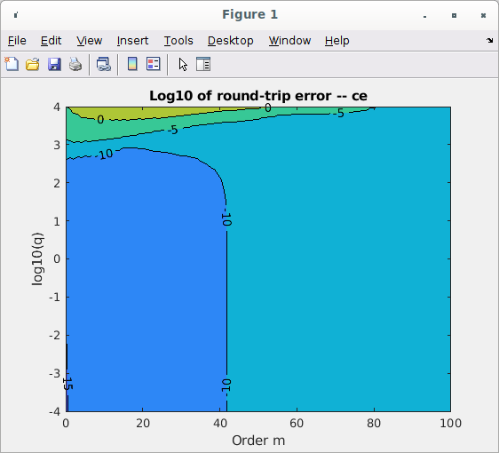

# A Matlab implementation of the Mathieu Functions.

This directory contains a Matlab implementation of the
Mathieu fcns computed using the usual Fourier expansion method.  The
Fourier coeffs are found by creating a recursion matrix, then finding
its eigenvalues and eigenvectors.  The eigenvectors provide the
coefficients used in the Fourier sum.  This is the method used by my
Northeastern REU students in Summer 2025.  Their paper provides
informationn about the method -- it is linked from here:

(https://sites.google.com/view/rtg-northeastern/undergraduate/independent-research-experience)

Here, I fleshed out the algos and translated them to Matlab.  I also
implemented the modified functions of the second kind.  This directory
provides the following Mathieu functions:

*  Angular fcn ce(n,q,v)
*  Angular fcn se(n,q,v)
*  Radial (modified) fcn of first kind mc1(n,q,u)
*  Radial (modified) fcn of first kind ms1(n,q,u)
*  Radial (modified) fcn of second kind mc2(n,q,u)
*  Radial (modified) fcn of second kind ms2(n,q,u)

Here, n = fcn order, q = frequency (geometry) parmeter, v = angular
coord (radians), u = radial coord (au).  Each function returns both
the value of the function as well as its derivative w.r.t. v, u
respectively. 

I also provide the following utility fcns:

*  Eigenvalue a_n(q)
*  Eigenvalue b_n(q)
*  Fourier coeffs A_n^k(q) for ce fcns (and associated modified fcns)
*  Fourier coeffs B_n^k(q) for se fcns (and associated modified fcns)

In this directory I also have unit tests based on identities from the
DLMF and hooks for golden value testing using GV produced by the code
in

(https://github.com/brorson/MathieuFcns)

That codebase computes the Mathieu angular functions using a
collocation method.

I performed extensive testing and characterization of the functions to
make sure they perform well over a reasonable domain of inputs.
Amongst other things, I did round-trip testing of the functions and
the associated ODEs.  I used a 6th order finite-difference formula to
evaluate the ODE using each function and its derivative as input.
Tests were performed for a section of the function's input domain for
varying order and parameter q.  Heat maps of each function's error are
shown below.  Note that the indicated error includes error associated
with evaluating the finite-difference derivative, so it represents an
error ceiling, not a floor.

The goal of this work is to prototype algorithms which may be
translated to C.

SDB, Summer 2025

